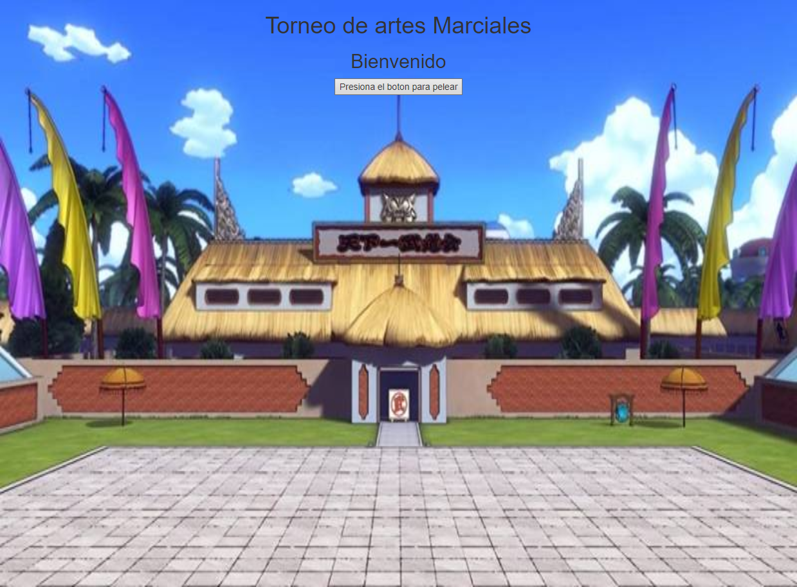
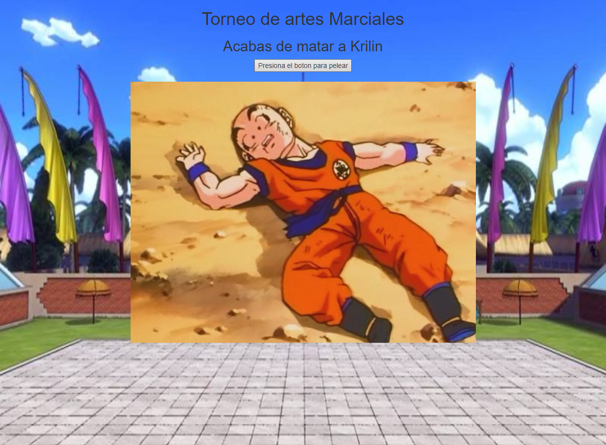
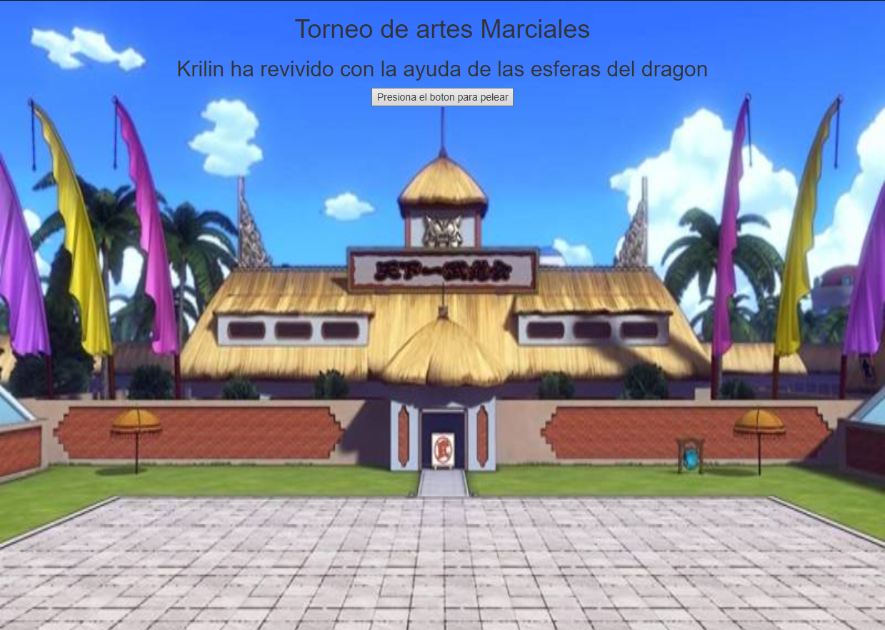
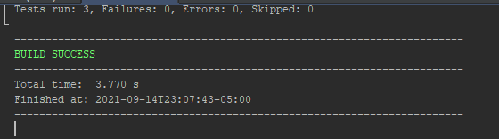
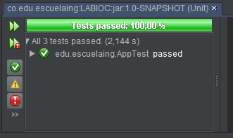

# AREP - Juan Contreras
# TALLER DE ARQUITECTURAS DE SERVIDORES DE APLICACIONES, META PROTOCOLOS DE OBJETOS, PATRÓN IOC, REFLEXIÓN

Para este taller los estudiantes deberán construir un servidor Web (tipo Apache) en Java. El servidor debe ser capaz de entregar páginas html e imágenes tipo PNG. Igualmente el servidor debe proveer un framework IoC para la construcción de aplicaciones web a partir de POJOS. Usando el servidor se debe construir una aplicación Web de ejemplo y desplegarlo en Heroku. El servidor debe atender múltiples solicitudes no concurrentes.

Para este taller desarrolle un prototipo mínimo que demuestre capcidades reflexivas de JAVA y permita por lo menos cargar un bean (POJO) y derivar una aplicación Web a partir de él. Debe entregar su trabajo al final del laboratorio.

# Clonando 
Clonamos el repositorio en la carpeta

$ git clone https://github.com/JuanC-358/TALLER-DE-ARQUITECTURAS-DE-SERVIDORES-DE-APLICACIONES.git

Nos dirigimos a la carpeta que contiene el proyecto

$ cd TALLER-DE-ARQUITECTURAS-DE-SERVIDORES-DE-APLICACIONES

Compilamos con maven

$ mvn package

Y por último corremos el programa

$ mvn exec:java -Dexec.mainClass="edu.escuelaing.nanosparkweb.NanoSparkWebDemo"
# Inicio 
ingresamos a http://localhost:35000/ para ver el proyecto local, o en su defecto a 
https://taller-de-arquitectura.herokuapp.com/

veremos lo siguiente:
### Index
El fondo del html es una imagen PNG

### Al presionar un boton
La imagen que aparece tiene formato PNG

### Al presionarlo nuevamente

## TEST
ejecutar el comando
$ mvn test

